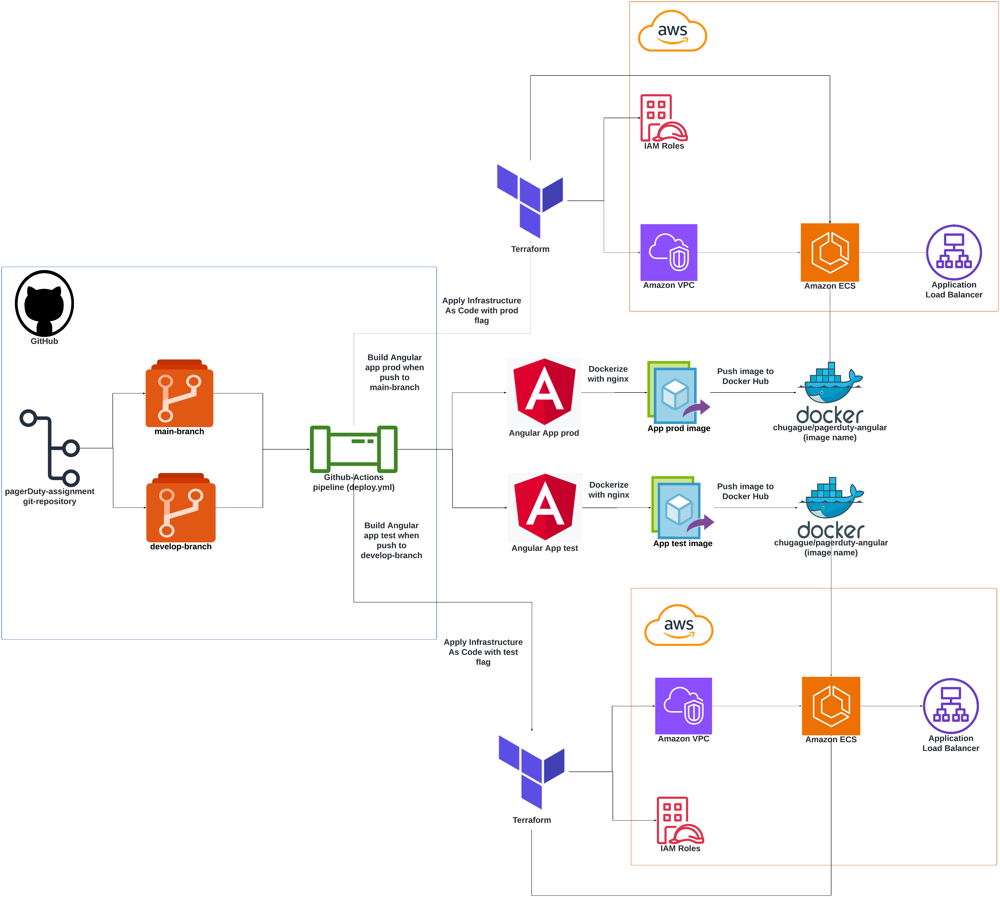
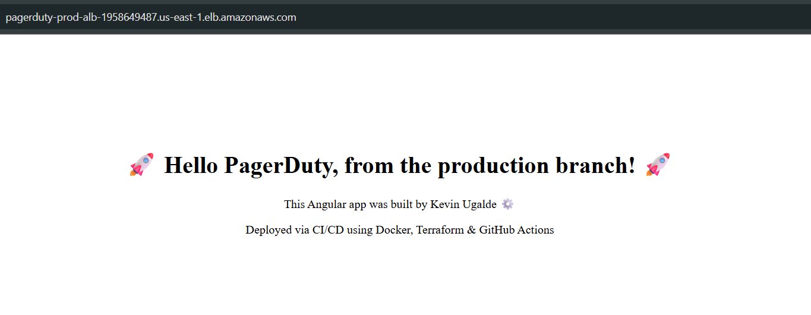

# PagerDuty Assignment – DevOps Take-Home Project


## Project Overview

This project demonstrates the use of DevOps best practices to provision and manage AWS infrastructure using Terraform, deploy a containerized Angular application with ECS, and automate deployments via CI/CD pipelines.

## Infrastructure Components

- AWS ECS Fargate Cluster
- Application Load Balancer (ALB)
- IAM roles
- Security Groups
- VPC + Subnets (via Terraform modules)

## CI/CD Workflow

- **Branch `develop`** : builds and deploys to **test** environment
- **Branch `main`**    : builds and deploys to **production** environment
- Docker image is tagged and pushed to Docker Hub with the branch name

## 📁 Repository Structure

```
.
├── .github/
│   └── workflows/
│       └── deploy.yml
├── app/                # Angular App
│   ├── Dockerfile
│   ├── src/
│   └── nginx/
│
├── terraform/
│   ├── main.tf
│   ├── variables.tf
│   ├── outputs.tf
│   └── modules/
│
├── README.md
└── .gitignore
```

## Architecture Overview

This diagram shows the GitHub-based CI/CD pipeline and the infrastructure created with Terraform for `test` and `production` environments:



## How to Deploy Manually

You can deploy this project from your local machine using Terraform and Docker.


### 1. Prerequisites

- AWS account with access key and secret
- Terraform CLI installed (v1.6.x or higher)
- Docker installed (optional, for local testing)
- Angular CLI installed (optional)
- A public Docker Hub repository (optional if not using CI/CD)

---


### 2. Clone the repository

```bash
git clone https://github.com/Chugague/pagerduty-assignment.git
cd pagerduty-assignment
```

### 3. Test the Angular app locally (optional)

```
cd app
npm install
ng serve
```
Visit http://localhost:4200

### 4. Build and containerize the Angular app locally (optional)

```
docker build --build-arg BUILD_ENV=test -t pagerduty-angular:test .
docker run -p 8080:80 pagerduty-angular:test
```
Visit http://localhost:8080

### 5. Configure AWS credentials

You must use an IAM user with permissions to manage ECS, ALB, IAM, and VPC resources. Make sure AWS CLI is installed, 
then run:

```
aws configure
```

### 6. Deploy to test environment

Make sure Terraform is installed, then run:

```
cd terraform/environments/test
terraform init
terraform apply -auto-approve
```

### 7. Destroy the environment (to avoid AWS charges)

```
terraform destroy -auto-approve
```

## How to Deploy via GitHub Actions pipeline

- Push to `develop` → deploys to **test** environment
- Push to `main`    → deploys to **production** environment

### GitHub Secrets Required for CI/CD

To enable GitHub Actions to deploy automatically, the following secrets must be configured in the repository:

| Secret Name             | Purpose                            |
|--------------------------|-------------------------------------|
| `DOCKERHUB_USERNAME`     | Docker Hub username                 |
| `DOCKERHUB_TOKEN`        | Docker Hub access token             |
| `AWS_ACCESS_KEY_ID`      | AWS IAM access key                  |
| `AWS_SECRET_ACCESS_KEY`  | AWS IAM secret access key           |

> 💡 These values must be added under **Settings → Secrets → Actions** in your GitHub repository.


## 🔍 Production Preview

Below is a live deployment of the app from the `main` branch:




## 🔍 Note

The production environment has been destroyed to avoid unnecessary AWS charges.  
To re-deploy it, simply push to the `main` or `develop` branch and the CI/CD pipeline will provision it automatically.


## Author

Kevin Ugalde  
DevOps and Software Engineer.
[github.com/Chugague](https://github.com/Chugague)